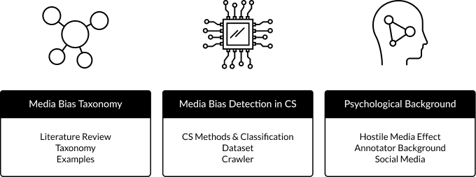

# Media Bias Taxonomy: Literature-Review
In this repo, we detail all workflows accompanying our Media Bias Taxonomy. Also, we publish an easily usable literature crawler to execute literature reviews. 



# Introduction
This repository contains all resources from the paper "The Media Bias Taxonomy: A Systematic Literature Review on the Forms and Automated Detection of Media Bias." Our literature review summarizes the research on computational methods to detect media bias by systematically reviewing 3140 research papers published between 2019 and 2022. The link to the paper will be added in case of journal acceptance. 

___

[1. Crawler](#1-crawler)
   
[2. The tables](#2-tables)

[3. Citation and more](#3-more)

# 1. Crawler
## Get started with our crawler
___
To facilitate research of media bias we share the code of the scraping tool we used to retrieve the candidate documents for our literature review. The tool uses the REST APIs of [Semantic Scholar](https://www.semanticscholar.org/) and [DBLP](https://dblp.org/) to retrieve literature from both platforms for a set of search terms. To search Semantic Scholar, you require a Semantic Scholar API Key.

## How to use the crawler
We provide the tool as a documented Jupyter Notebook:
```
crawler_ses-dblp.ipynb
```


Follow these steps to use the tool:
1. Make sure that you have the modules requests, json, pandas, numpy, tqdm, and time installed and up-to-date.
2. In the "Search Parameters" section of the scraping tool, you can adjust setting to your search preferences:
   - **search_semantic_scholar** and **search_dblp** : Where to perform the search.
   - **year_range_start** and **year_range_start** : Settings for the publication period to search for.
   - **SSkey** : Insert your Semantic Scholar Key here.
   - **max_ses** : Number of Document per keyword to be retrieved from Semantic Scholar. Use multiples of 100 (e.g., 200, 700, 1500).
   - **return_fieldes** : Choose, which information the tool retrieves on each publication from Semantic Scholar.
   - **publication_type** : Types of publications to be searched for on Semantic Scholar.
   - **fields_of_Study** : Select from a range of fields of study to be searched for on Semantic Scholar.
3. **Preparing Keywords**. Provide a keyword file named "keywords_ses.txt" for Semantic Scholar and "keywords_ses.txt" for DBLP, in which each line contains a search query.

The Jupyter Nootebook provides further instructions on how to use the tool In the comments and Markdowm segments.

# 2. The tables
As mentioned in the paper, we publish the accompanying tables. They can be found [here on Zenodo](https://zenodo.org/deposit/7707761).

# 3. Citation
Please cite us as:
```python
@inproceedings{
    title = {The Media Bias Taxonomy: A Systematic Literature Review on the Forms and Automated Detection of Media Bias.},
    author = {Spinde, Timo and Hinterreiter, Smi and Haak, Fabian and Ruas, Terry and Giese, Helge and Meuschke, Norman and Gipp, Bela},
    year = {2023},
    note = {[in review]}
}
```

